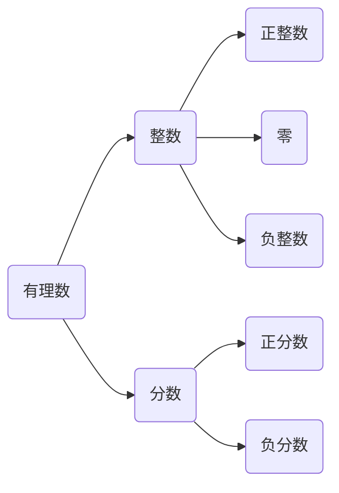
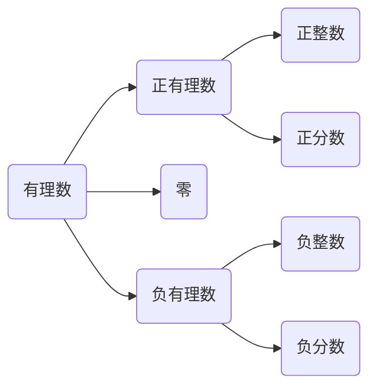

### 1.1 有理数的有关概念
#### 知识1 正数、负数
##### 1.定义
(1) 正数：像$+\dfrac{1}{2}$,$+12$,$1.3$,$258$这样大于$0$的数（$+$通常省略不写）叫正数.  
(2) 负数：像$-5, -3\tfrac{3}{4}, -0.1$这样在正数前加上$-$（负）的数叫负数，负数小于$0$.

##### 2.正、负数的意义
(1) 具有相反意义的量  
　　正数和负数的引入是为了在实际问题中区分表示相反意义的量.  
　　为了用数表示具有相反意义的量，==我们把某种量的一种意义规定为正的，而把与它相反的一种意义规定为负的==. 负数是根据实际需要而产生的.  
(2) 具有相反意义的量的表述：  
　　描述一对具有相反意义的量的词语一般是一对反义词，如上升与下降，增加与减少，盈利与亏损，收入与支出等.  
(3) 属性  
　　==$0$既不是正数也不是负数==，它是一个非负、非正的数，正、负数以$0$为界，==规定:$0$是最小的自然数==. 

> 3 用正数和负数表示具有相反意义的量时，哪种意义的量为正是可以任意选定的（如将上升 2 米来规定为 +2 米或 -2 米都可以），一旦选定一种意义的量为正，则另一种相反意义的量就只能为负.
#### 知识2 有理数及其分类
1. 按有理数的定义分类：  

2. 按有理数的性质分类：

> 整数与分数对应，正数与负数对应，零既不是整数也不是负数，它是整数也是有理数. 在习惯上我们将正有理数和零称为非负有理数，将负有理数和零称为非正有理数，将正整数和零称为非负整数，将负整数和零称为非正整数.
#### 知识3 数轴及其三要素
##### 1.定义
数轴是规定了原点、正方向和单位长度的直线.
##### 2.数轴的画法
> (1) 画一条水平的直线.  
> (2) 在直线上适当选取一点为原点.  
> (3) 通常规定从原点向右为正方向，用箭头表示出来（箭头标在划出部分的最右边）.  
> (4) 根据需要，选取适当的长度为单位长度，从原点向右和向左每隔一个单位长度(任意长度)取一个点，依次按单位长度递增标注出来.
#### 知识4 相反数
##### 1.定义
像 2 和 -2，5 和 -5 这样，==只有符号不同的两个数叫做互为相反数==. 特别地，==0 的相反数是 0==.
##### 2.相反数的性质
若$a,b$互为相反数，则$a+b=0$；反之，若$a+b=0$，则$a,b$互为相反数.  
$x+(-x)=0$  
> 1 相反数是成对出现的，不能单独存在. 单独的一个数不能说是相反数.  
> 2 要把“相反数”和“相反意义的量”区分开来. 
##### 3.相反数的几何意义
一般地，在数轴上，互为相反数的两个数对应的点在原点的两侧，并且到原点的距离相等.  
> 由相反数的几何意义可知：在数轴上原点的两侧，到原点的距离相等的两个点所表示的数互为相反数，显然互为相反数的两个数只是“符号不同”.
#### 知识5 绝对值
##### 1.定义
==一般地，数轴上表示数 a 的点与原点的距离叫做数 a 的绝对值==  
数 a 的绝对值基座 $|a|$，读作 a 的绝对值  
##### 2.绝对值的代数意义
一个正数的绝对值是它本身；一个负数的绝对值是它的相反数；0 的绝对值是 0  
绝对值的代数意义用式子可表示为：  
$|a|=\left\{\begin{aligned}
a, a>0,\\ 
0,a=0,\\ 
-a,a<0
\end{aligned}\right.$  
或$|a|=\left\{\begin{aligned}
a, a\geqslant 0,\\ 
-a, a<0
\end{aligned}\right.$

##### 3.绝对值的几何意义
一个数的绝对值就是表示这个数的点到原点的距离，离原点的距离越远，绝对值越大，离原点的距离越近，绝对值越小
> 1 绝对值为同一个正数的数有两个，它们互为相反数.  
> 2 互为相反数的两个数的绝对值相等. 绝对值相等的两个数相等或互为相反数.  
> 3 绝对值是一种运算，
##### 方法1 正负数的识别方法
对于正数和负数，不能简单地理解为带“+”的数是正数，带“-”的数是负数，要看其本质是正数还是负数. 例如：(1)$a>0$时，$a$表示正数，$-a$表示负数；(2)$a<0$时，$a$表示负数，$-a$表示正数；(3)$a\geqslant 0$时，$a$表示非负数.
